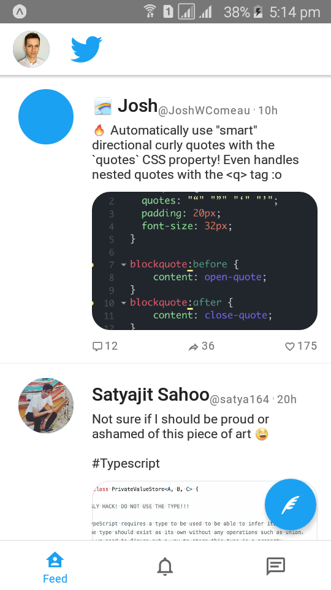
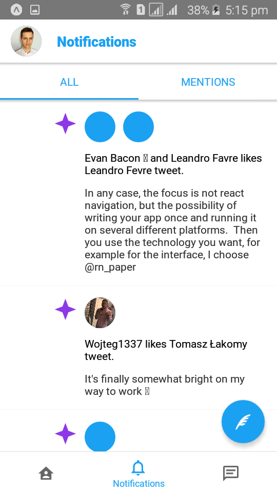
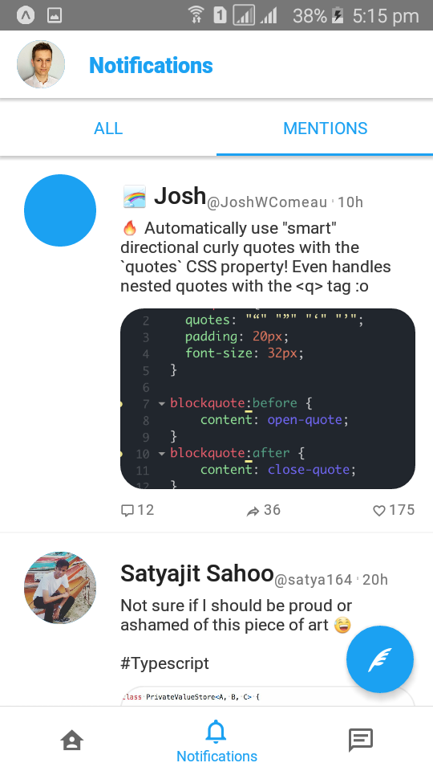
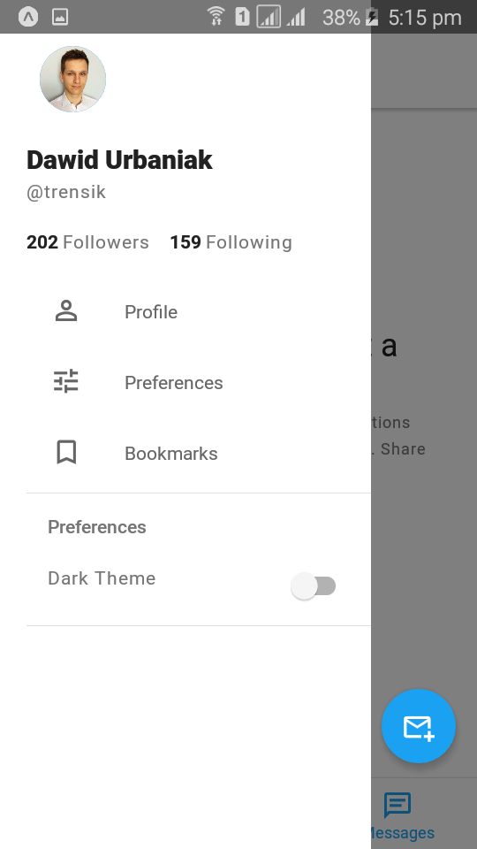
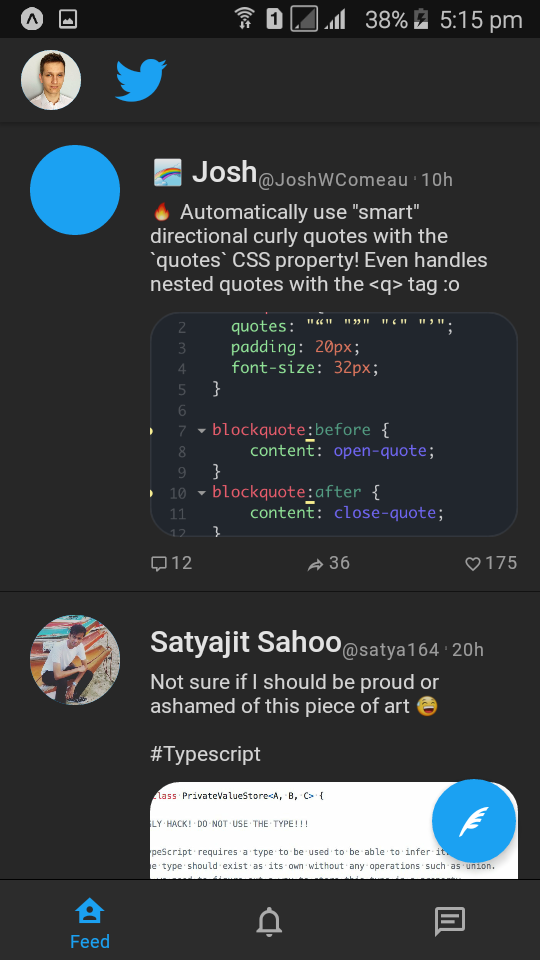

# Learning React Native Navigation v5

Following this awesome article - https://reactnavigation.org/blog/2020/01/29/using-react-navigation-5-with-react-native-paper, I learned about react-navigation version 5 and also a lot about react-native paper.

### Key Learnings -

- React Navigation v5, using the Stack, Drawer and Tab Components.
- Nesting the routes.
- Basic overview of using React Native Paper Components.
- Theming.

